# HexBlock Shield

<p align="center">
  
</p>

<p align="center">
  <a href="https://chromewebstore.google.com/detail/hexblock-shield/bmjflnnopehafhmelobgbjeobdhokifj"></a>
  <a href="https://github.com/happygream/hexblock-shield/releases"></a>
  
  
</p>

<br/>

Browser extension for the [HexBlock](https://hexblock.co.uk) privacy gateway. Blocks ads and trackers at the network level, skips YouTube ads and sponsor segments, and strips Twitch stream ads from HLS playlists.

## Features

- **Ad blocking** — EasyList via declarativeNetRequest. Blocks ad requests before they load.
- **Tracker blocking** — EasyPrivacy. Blocks fingerprinting scripts and analytics.
- **YouTube** — Pre-roll and mid-roll ad skipping. SponsorBlock integration for sponsor segments, intros, outros, and self-promotion. Privacy-preserving — only a 4-character SHA-256 hash prefix of the video ID is sent to the API.
- **Twitch** — HLS M3U8 playlist ad segment stripping. Intercepts the stream playlist before the player loads it and removes ad discontinuity blocks. No proxying — everything runs locally in the browser.
- **Cosmetic filtering** — Hides ad placeholders and cookie banners that survive network-level blocking.
- **HexBlock gateway sync** — Optionally pull blocklists from your self-hosted HexBlock instance and report block events to the dashboard.

## Installation

| Browser | Store |
|---------|-------|
| Chrome | [Chrome Web Store](https://chromewebstore.google.com/detail/hexblock-shield/bmjflnnopehafhmelobgbjeobdhokifj) |
| Firefox | Firefox Add-ons — submission pending |
| Edge | Microsoft Edge Add-ons — submission pending |

### Manual install (developer mode)

1. Download the latest release zip from [Releases](https://github.com/happygream/hexblock-shield/releases)
2. Extract the zip
3. Go to `chrome://extensions` (Chrome) or `edge://extensions` (Edge)
4. Enable **Developer mode**
5. Click **Load unpacked** and select the extracted folder

For Firefox: go to `about:debugging#/runtime/this-firefox`, click **Load Temporary Add-on**, and select the `manifest.json` file.

## Project structure

```
hexblock-shield/
  manifest.json          Extension manifest (MV3)
  popup.html             Extension popup UI
  src/
    background.js        Service worker — settings, stats, gateway sync
    content.js           General cosmetic filtering on all pages
    youtube.js           YouTube ad skip and SponsorBlock
    twitch.js            Twitch HLS M3U8 ad segment stripper
    popup.js             Popup UI logic
    storage.js           Storage helpers
  lists/
    easylist.json        EasyList rules in declarativeNetRequest format
    easyprivacy.json     EasyPrivacy rules in declarativeNetRequest format
    youtube_ads.json     YouTube-specific ad request rules
  icons/
    icon16.png
    icon32.png
    icon48.png
    icon128.png
```

## How Twitch ad blocking works

Twitch embeds ads as segments inside the same HLS video stream as the content. DNS blocking cannot stop them because the ad and video segments come from the same domains.

HexBlock Shield wraps the browser's native `fetch()` and `XMLHttpRequest` before Twitch's player initialises. When a Twitch HLS playlist (`.m3u8`) is requested, the extension intercepts the response, scans it for Twitch ad markers (`stitched-ad`, `X-TV-TWITCH-AD`, `EXT-X-AD`), strips the ad segment blocks, and returns the cleaned playlist to the player. The player never sees the ad segments.

No traffic is proxied through any external server. Everything runs locally in the browser.

## HexBlock gateway

HexBlock Shield can optionally connect to a self-hosted [HexBlock](https://github.com/happygream/hexblock) instance to:

- Pull custom blocklists from your server
- Report block events to the HexBlock dashboard query log

Configure the gateway URL in the Settings tab of the extension popup.

## Permissions

| Permission | Why |
|------------|-----|
| `storage` | Save settings and per-tab stats |
| `declarativeNetRequest` | Block ad and tracker requests |
| `tabs` | Read current tab URL for the popup |
| `scripting` | Inject content scripts dynamically |
| `<all_urls>` | Apply cosmetic filtering on all pages |

## License

MIT — see [LICENSE](LICENSE)

## Related

- [HexBlock](https://github.com/happygream/hexblock) — self-hosted privacy gateway
- [hexblock.co.uk](https://hexblock.co.uk)
